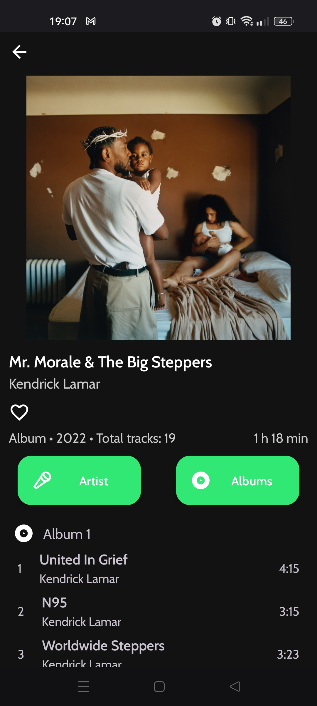
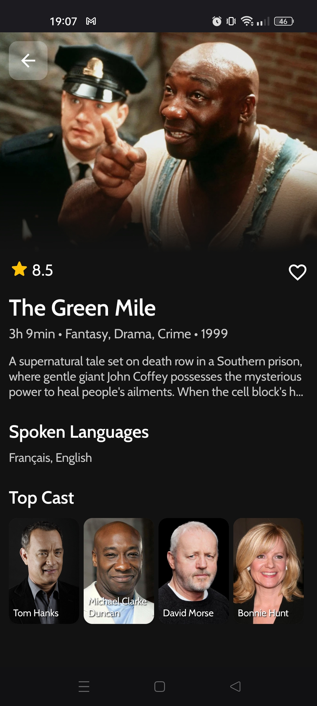

# Vuey


Vuey is open source Album, Movies and TV Shows Tracker.

## Screenshots


<div>
  
  
</div>

## Project Setup

1. Clone repository and open project in the latest version of Android Studio.
2. Generate and import your `google-services.json` file and put it in the `/app`
3. Create `local.properties` and import it to `/app`
4. Add your [Spotify](https://developer.spotify.com/) SPOTIFY_CLIENT_ID and SPOTIFY_CLIENT_SECRET and [TMDB](https://developer.themoviedb.org/docs) key in `local.properties`
```
TMDB_API_KEY="YOUR_TMDB_API_KEY"
SPOTIFY_CLIENT_ID="YOUR_SPOTIFY_CLIENT_ID"
SPOTIFY_CLIENT_SECRET="YOUR_SPOTIFY_CLIENT_SECRET"
```
5. Clean and rebuild project

## TODO
- [X] Notifications
- [X] Improve UX/UI
- [X] Statistic Screen
- [ ] Artist Fragment UI

## Tech
- [Retrofit](https://square.github.io/retrofit/)
- [Kotlin Coroutines](https://github.com/Kotlin/kotlinx.coroutines)
- [Dagger-Hilt](https://developer.android.com/training/dependency-injection/hilt-android)
- [OkHttpClient](https://square.github.io/okhttp/4.x/okhttp/okhttp3/-ok-http-client/)
- [Firebase](https://firebase.google.com/)
- [Room Database](https://developer.android.com/training/data-storage/room)
- [Gson](https://github.com/google/gson)
- [Coil](https://coil-kt.github.io/coil/)
- [SwipeRefreshLayout](https://developer.android.com/develop/ui/views/touch-and-input/swipe/add-swipe-interface)
- [Palette](https://developer.android.com/develop/ui/views/graphics/palette-colors)
