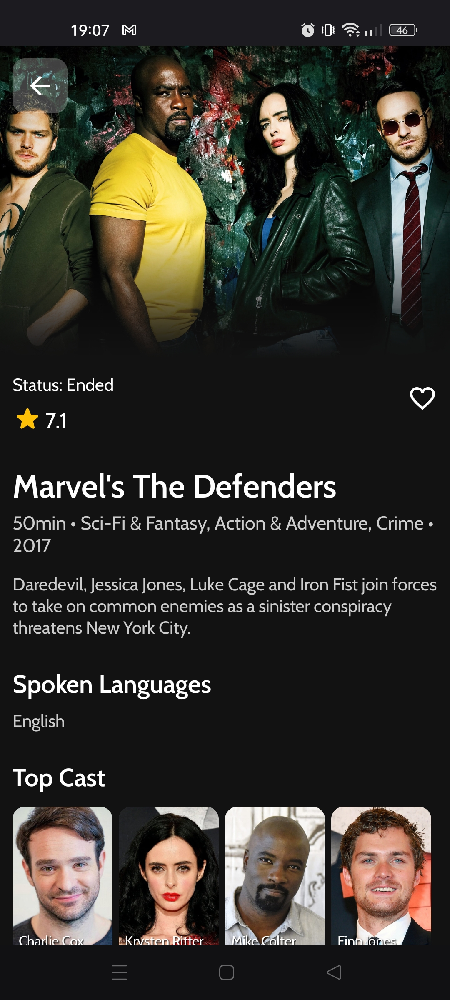
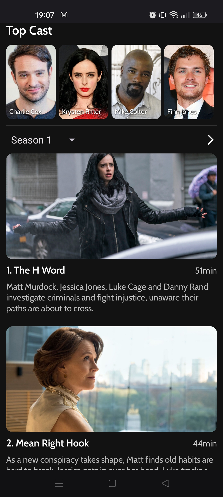
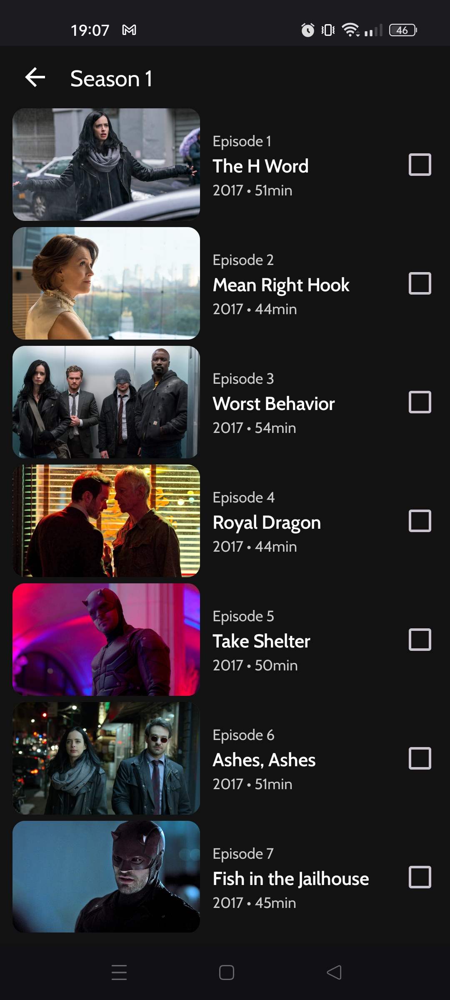

# Vuey


Vuey is open source Album, Movies and TV Shows Tracker.

## Screenshots


<div>
  
  
  
  
  
</div>

## Project Setup

1. Clone repository and open project in the latest version of Android Studio.
2. Generate and import your `google-services.json` file and put it in the `/app`
3. Create `local.properties` and import it to `/app`
4. Add your [Spotify](https://developer.spotify.com/dashboard) SPOTIFY_CLIENT_ID and SPOTIFY_CLIENT_SECRET and [TMDB](https://developer.themoviedb.org/docs) key in `local.properties`
```
TMDB_API_KEY="YOUR_TMDB_API_KEY"
SPOTIFY_CLIENT_ID="YOUR_SPOTIFY_CLIENT_ID"
SPOTIFY_CLIENT_SECRET="YOUR_SPOTIFY_CLIENT_SECRET"
```
5. Clean and rebuild project
